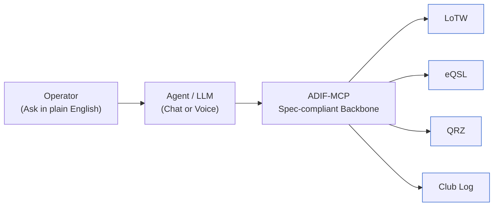

# Concepts Overview

- **Core MCP**: declares canonical ADIF types + read/write tools
- **Plugins**: add LoTW/eQSL capabilities via separate MCP servers
- **Safety**: schemas/validators sit at the boundary (no raw access)

## Project Ethos

ADIF-MCP is a community-driven effort.

It is not intended to replace or compete with existing ADIF libraries, utilities, or logging applications. Instead, it provides a common foundation that others can build upon:
- Interoperability — a schema-driven, spec-compliant core that makes it easier for tools, logs, and services to talk to each other.
- Extensibility — a plugin and integration framework for services like LoTW, eQSL, QRZ, and future platforms.
- Collaboration — designed to complement, not fragment, the ecosystem of ADIF tools already enjoyed by the ham community.
- Future-facing — introduces safe, typed access to ADIF data in contexts such as AI agents and MCP integrations, opening doors for innovation while preserving compatibility.

Our goal is simple: support and enhance the Amateur Radio logging ecosystem while keeping the project open, transparent, and aligned with the spirit of the hobby.

---

## Why ADIF-MCP Matters

Most amateur operators just want answers from their logs — “Did I work that station on 30m last month?” or “Which of my QSOs are still unconfirmed on LoTW?”

Traditionally, getting those answers means:
- Exporting logs,
- Writing custom scripts,
- Or relying on a patchwork of tools and websites.

That’s a big barrier, especially for operators without coding experience.

This is where ADIF-MCP changes the game:
- Backbone: ADIF-MCP provides a spec-compliant, schema-driven foundation to interact with log data.
- Agents: AI tools (chat-based or voice-driven) can sit on top, letting operators ask natural language questions about their logs.
- Integrations: Connect seamlessly to LoTW, eQSL, QRZ, Club Log, and beyond.

In short: ADIF-MCP handles the plumbing; agents handle the conversation.
Together, they unlock an operator-friendly way to query and use logbooks without needing to code.

---

### The above diagram shows:
- Operator: just speaks or types in plain English.
- Agent (LLM): interprets the question, decides what log data to fetch.
- ADIF-MCP: ensures queries & responses are safe, typed, ADIF-compliant.
- Logbooks: LoTW, eQSL, QRZ, Club Log (your “big four”).

---

## Plugins
- Common in developer-first frameworks and ecosystems where you’re extending the core with extra functionality.
- Examples: MkDocs plugins, Pre-commit hooks, pytest plugins.
- Implies that they “hook into” the core and may follow a standardized API.
- Pro: Familiar to devs.
- Con: Sounds very dev-internal, less approachable to end users.

---

## Integrations
- Common in user-facing platforms and SaaS ecosystems.
- Examples: GitHub Integrations, Slack Integrations, Zapier Integrations.
- Implies “this connects our tool with an external service”.
- Pro: Clear to hams/operators — “this integrates LoTW with MCP”.
- Con: Less precise if you eventually add internal extensions that aren’t really external integrations.

⸻

## Modules / Extensions
- Neutral naming used in Python, Node, etc.
- Examples: Django “apps”, VS Code “extensions”.
- Pro: Generic, flexible.
- Con: Ambiguous unless you define it well.

⸻

## What the ADIF/MCP ecosystem is closest to
- Since LoTW, eQSL, QRZ, Clublog, Qrz, etc, are logging apps are all external services that MCP connects to ...
- “Plugins” would make sense if you were exposing a developer API for others to build custom code inside MCP.
