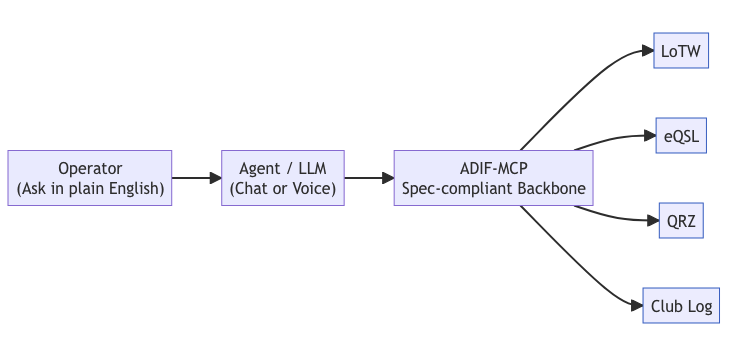

# Concepts Overview

- **Core MCP**: declares canonical ADIF types + read/write tools
- **Integrations**: add LoTW/eQSL/QRZ/Club Log via separate MCP servers
- **Safety**: schemas/validators sit at the boundary (no raw access)

> Looking for the “why”? See **[Why ADIF-MCP Matters](why-matters.md)**.

---

